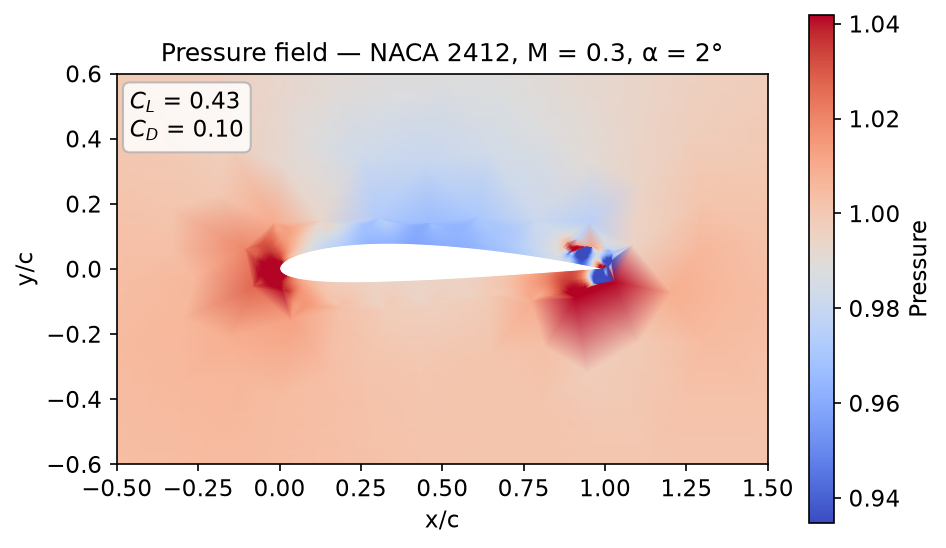
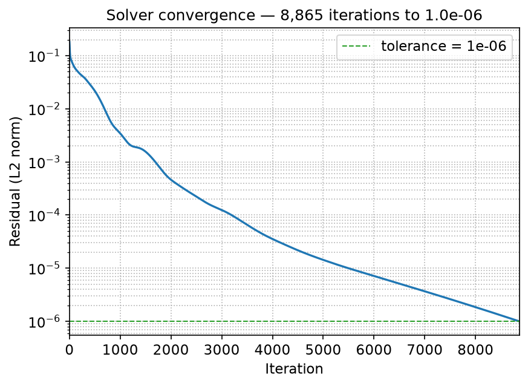
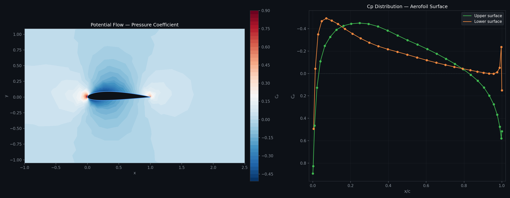
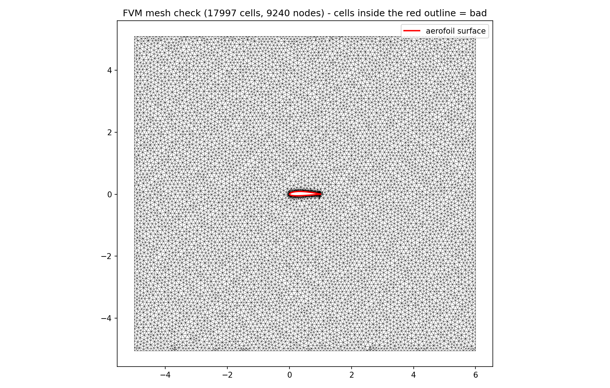
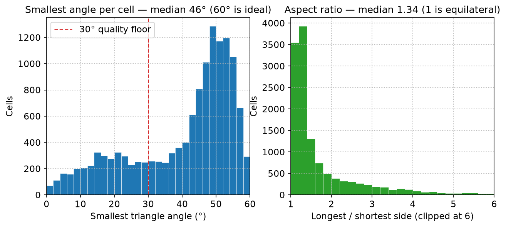
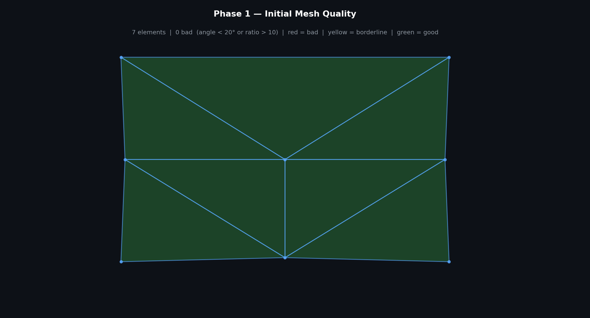
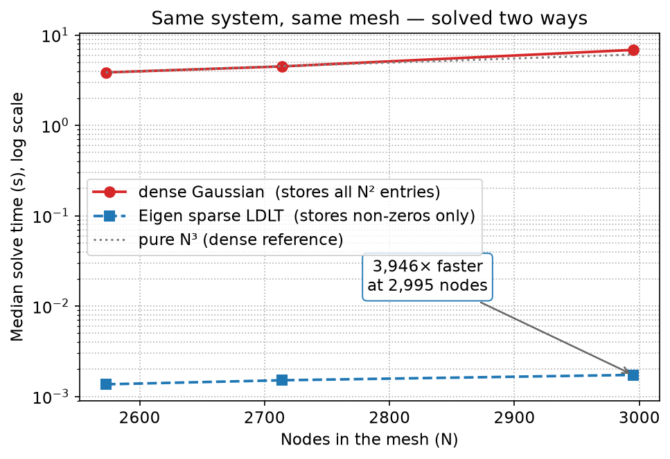
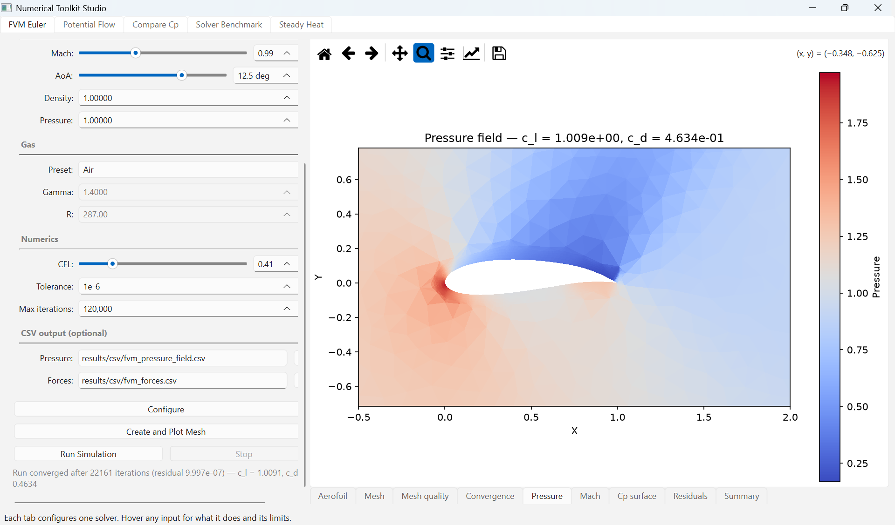
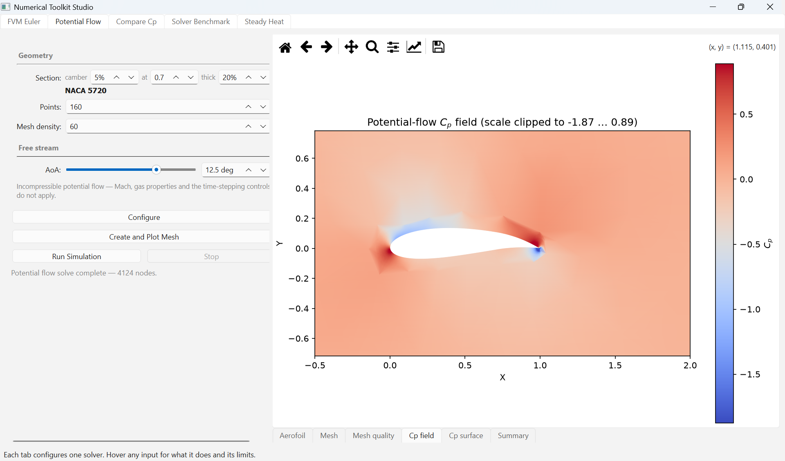
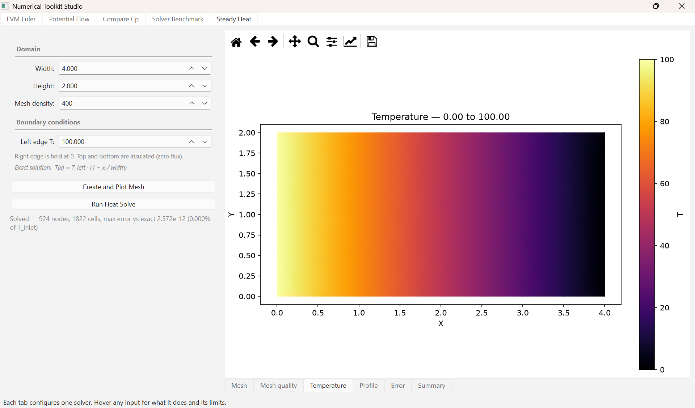

# Numerical Toolkit

**A 2D computational fluid dynamics toolkit in modern C++ — unstructured mesh generation, a finite-volume Euler airfoil solver, and finite-element potential-flow and heat solvers, built from scratch on Eigen and driven by an interactive Python desktop app.**

[](https://github.com/ks2330/Numerical_Toolkit/actions/workflows/ci.yml)


<p align="center">
  
  
</p>

Finite-volume Euler solve of a NACA 2412 at M = 0.3, α = 2°: the pressure field over a watertight
surface (C_L ≈ 0.43, C_D ≈ 0.10) and the residual converging to 1e-6 in 8,865 iterations.

---

## Overview

Numerical Toolkit is a from-scratch C++20 CFD library targeting 2D aerodynamic analysis of
airfoils on **unstructured triangular meshes**. Everything from the mesh generator to the
flux functions is implemented directly on top of [Eigen](https://eigen.tuxfamily.org) —
no meshing or solver frameworks — and covered by a GoogleTest suite that runs in CI.

The project is organised as a static library (`numerical_toolkit`) with the solver internals
kept free of I/O, so they can be driven directly — by a command-line driver, a `pybind11`
Python module (`pycfd`), and an interactive desktop app (**Numerical Toolkit Studio**, below),
all with no CSV round-trip.

## Highlights

- **Unstructured mesher**: Bowyer–Watson Delaunay triangulation (with an experimental
  Advancing-Front path), Poisson-disc interior sampling, boundary-layer seeding around the
  airfoil, and **constrained Delaunay edge recovery** that guarantees a watertight surface.
- **Finite-volume Euler solver**: cell-centred, first-order, matrix-free — Rusanov
  (local Lax–Friedrichs) flux, explicit local time-stepping, slip-wall and far-field
  boundary conditions, and aerodynamic force/coefficient integration (C_L, C_D).
- **Finite-element solvers**: potential flow (Laplace, ∇²φ = 0 → velocity → Cₚ via
  Bernoulli) and steady-state heat conduction on the same unstructured mesh; plus a 1D
  transient heat solver (forward-Euler and Crank–Nicolson).
- **Quality tooling**: quadtree spatial indexing, quality refinement + Laplacian
  smoothing, and mesh-quality metrics (min-angle / aspect-ratio distributions).
- **Interactive desktop app**: a PySide6 GUI (Numerical Toolkit Studio) driving every solver
  through a compiled `pybind11` module — live convergence, in-memory matplotlib rendering, and
  a dense-vs-sparse solver benchmark (up to ~3,900× faster), all with no CSV round-trip.
- **Engineering**: CMake + FetchContent (reproducible Eigen / GoogleTest), 13 GoogleTest
  suites (155 tests), and GitHub Actions CI.

## Solvers

### Finite-Volume Euler (compressible, inviscid)
Solves the 2D Euler equations with a cell-centred finite-volume method: Rusanov numerical
flux across faces, explicit CFL-limited local time-stepping to steady state, ghost-cell
slip-wall and free-stream far-field conditions. Surface-pressure integration yields lift
and drag coefficients.

### Finite-Element Potential Flow (incompressible, irrotational)
Assembles the Laplacian stiffness matrix over the triangulation, applies far-field
Dirichlet and natural wall conditions, solves for the velocity potential φ, and recovers
the per-element velocity and surface pressure coefficient Cₚ.

<p align="center">
  
</p>

### Heat Equation
1D transient diffusion via explicit forward-Euler and implicit Crank–Nicolson schemes
(sparse Eigen assembly), and 2D steady-state conduction via the FEM Laplacian with
Dirichlet boundary conditions.

## Meshing

The mesher is the backbone of the toolkit: it generates an airfoil surface from a NACA
4-digit code, wraps it in a far-field boundary, samples the interior, triangulates, removes
the hole interior, and recovers the constrained boundary so the airfoil surface is
watertight — a prerequisite for correct finite-volume force integration.

<p align="center">
  
  
</p>

<p align="center">
  
</p>

Iterative refinement and Laplacian smoothing raising triangle quality during meshing.

## Results

For a **NACA 2412** at **M = 0.3, α = 2°**, the finite-volume Euler solver converges to a
residual of **~1e-6** (8,865 iterations) and reports **C_L ≈ 0.43**, **C_D ≈ 0.10**. The lift
agrees with thin-airfoil theory — 2π(α − α₀) with a zero-lift angle α₀ ≈ −2° for 2% camber
gives C_L ≈ 0.44 — and the constrained-Delaunay edge recovery keeps the airfoil surface
**watertight**, so the pressure force is integrated over a truly closed body, not a leaky one.

The residual drag is numerical rather than physical (the true inviscid, d'Alembert drag is
zero): it is the dissipation of the **robust first-order Rusanov flux**, the trade-off for its
stability. The roadmap's **second-order MUSCL reconstruction** and near-wall refinement are
accuracy upgrades that would tighten it further — the current scheme is already a solid,
convergent baseline.

## Performance — sparse vs dense linear solve

The finite-element solvers assemble a sparse, symmetric positive-definite system. The
original solver used textbook **dense Gaussian elimination** — O(N³) time, O(N²) memory —
which dominates runtime as the mesh grows. Swapping in Eigen's **sparse Cholesky**
(`SimplicialLDLT`) solves the *same* system, to machine precision, orders of magnitude faster:

| Nodes | Dense Gaussian (ms) | Sparse LDLᵀ (ms) | Speed-up | max nodal Δφ |
|------:|--------------------:|-----------------:|---------:|-------------:|
| 2,573 |               3,854 |             1.36 |   2,824× |      1.4e-12 |
| 2,714 |               4,493 |             1.51 |   2,970× |      7.4e-12 |
| 2,995 |               6,840 |             1.73 |   3,946× |      1.9e-12 |

*Median of 3 timed runs, potential-flow solve on the airfoil mesh. `max nodal Δφ` is the
largest difference between the two solvers' potentials — agreement to machine precision, so
this is a pure speed win.* Dense cost grows with the **cube** of the node count while the
sparse solve stays near-linear, so the gap widens with resolution. The benchmark is exposed
as its own tab in Numerical Toolkit Studio:

<p align="center">
  
</p>

## Desktop app (Numerical Toolkit Studio)

An interactive PySide6 front-end drives every solver through a compiled **pybind11** module
(`pycfd`) — no CSV round-trip, no subprocess. Each tab configures one solver: the
finite-volume Euler airfoil (live convergence plot + C_L / C_D), finite-element potential
flow with an Euler-vs-potential Cₚ comparison, 2D steady-state heat conduction, and a
dense-vs-sparse solver benchmark. Pick a NACA 4-digit section and flow parameters, run the
solve on a background thread, and see the field rendered in-memory with matplotlib.

<p align="center">
  
</p>

<p align="center">
  
  
</p>

### Run it

**Download — no build, no Python:** grab `NumericalToolkitStudio-win64.zip` from the
[**latest release**](https://github.com/ks2330/Numerical_Toolkit/releases/latest), unzip, and run
`NumericalToolkitStudio.exe`. Nothing to install.

**Or run from source** (needs Python 3.14; building the `pycfd` module needs MSVC — full steps in
[DESKTOP_APP.md](DESKTOP_APP.md)):

```powershell
py -3.14 -m venv .venv
.\.venv\Scripts\Activate.ps1
pip install -r requirements.txt
python python\cfd_studio\numerical_toolkit_studio.py
```


## Build & run

**Prerequisites:** a C++20 compiler, CMake ≥ 3.21, [Ninja](https://ninja-build.org), and git.
Eigen and GoogleTest are fetched automatically by CMake.

```bash
git clone https://github.com/ks2330/Numerical_Toolkit.git
cd Numerical_Toolkit

cmake --preset ci        # configure (Ninja, Release) + fetch dependencies
cmake --build --preset ci
ctest --preset ci        # run the toolkit test suite
```

Run a solver (from the repository root, so the relative `results/` paths resolve):

```bash
./build/apps/FVM_solver/fvm_solver          # Euler airfoil solve → results/csv/*.csv
python apps/FVM_solver/plot_fvm.py          # visualise the pressure/Mach field
```

## Project structure

```
include/          public headers for the numerical_toolkit library
  nt/finite_methods/            forward-Euler / Crank–Nicolson (1D heat)
  nt/finite_element_methods/    FEM stiffness, potential flow, heat
  nt/finite_volume_methods/     gas model, mesh/faces, flux, solver, forces
  nt/solvers/                   dense + Eigen-sparse potential-flow solvers (benchmark)
  mesh_generation/              mesh types, triangulation, sampling, metrics
src/              library implementation (mirrors include/)
apps/FVM_solver/  2D Euler finite-volume airfoil driver (CLI)
bindings/         pybind11 module (pycfd) exposing the solvers to Python
python/cfd_studio/  Numerical Toolkit Studio — PySide6 desktop app
tests/            GoogleTest suites (13 executables, 155 tests, run via ctest)
results/          generated CSV / PNG outputs
docs/             figures and animations
```

## Tech stack

C++20 · [Eigen 3.4](https://eigen.tuxfamily.org) (linear algebra) · CMake + FetchContent ·
Ninja · [GoogleTest](https://github.com/google/googletest) · GitHub Actions CI · Python
(matplotlib) for offline visualisation.

## Roadmap

- **Higher-fidelity FVM** — second-order MUSCL reconstruction and near-wall refinement to
  drive down numerical drag.
- **Advancing-Front meshing** — finish the alternative triangulator (currently experimental;
  constrained Delaunay is the default).
- **Lifting potential flow** — Kutta condition / trailing-edge circulation.

## License

Released under the [MIT License](LICENSE).
