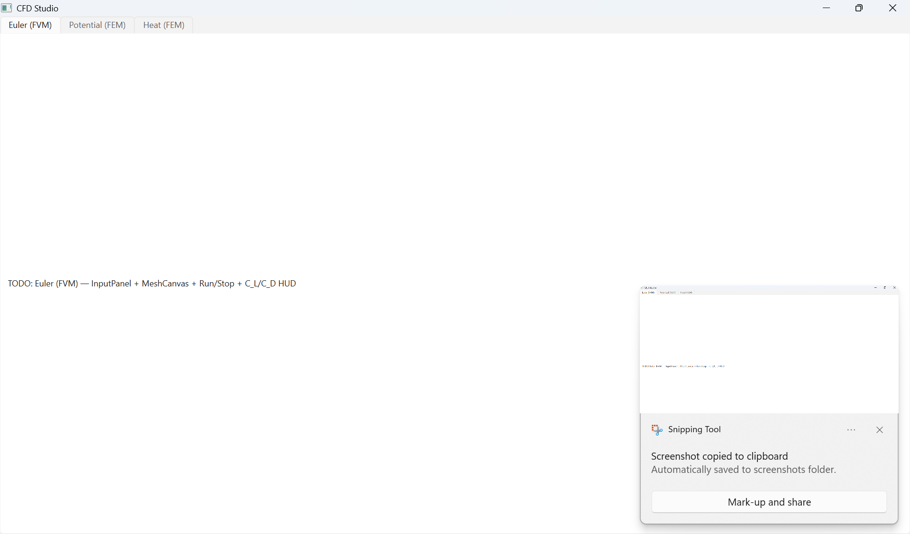

# Numerical Toolkit

**A 2D computational fluid dynamics toolkit in modern C++ — unstructured mesh generation, a finite-volume Euler airfoil solver, and finite-element potential-flow and heat solvers, built from scratch on Eigen.**

[](https://github.com/ks2330/Numerical_Toolkit/actions/workflows/ci.yml)


<p align="center">
  
</p>

Pressure and Mach fields from the finite-volume Euler solver around an airfoil at M = 0.3, α = 2°.

---

## Overview

Numerical Toolkit is a from-scratch C++20 CFD library targeting 2D aerodynamic analysis of
airfoils on **unstructured triangular meshes**. Everything from the mesh generator to the
flux functions is implemented directly on top of [Eigen](https://eigen.tuxfamily.org) —
no meshing or solver frameworks — and covered by a GoogleTest suite that runs in CI.

The project is organised as a static library (`numerical_toolkit`) plus small command-line
driver applications, with the solver internals kept free of I/O so they can be driven
directly (the roadmap below builds an interactive desktop app on exactly this seam).

## Highlights

- **Unstructured mesher**: Bowyer–Watson Delaunay triangulation, an Advancing-Front
  alternative, Poisson-disc interior sampling, boundary-layer seeding around the airfoil,
  and **constrained Delaunay edge recovery** that guarantees a watertight surface.
- **Finite-volume Euler solver**: cell-centred, first-order, matrix-free — Rusanov
  (local Lax–Friedrichs) flux, explicit local time-stepping, slip-wall and far-field
  boundary conditions, and aerodynamic force/coefficient integration (C_L, C_D).
- **Finite-element solvers**: potential flow (Laplace, ∇²φ = 0 → velocity → Cₚ via
  Bernoulli) and steady-state heat conduction on the same unstructured mesh; plus a 1D
  transient heat solver (forward-Euler and Crank–Nicolson).
- **Quality tooling**: quadtree spatial indexing, quality refinement + Laplacian
  smoothing, and mesh-quality metrics (min-angle / aspect-ratio distributions).
- **Engineering**: CMake + FetchContent (reproducible Eigen / GoogleTest), 13 GoogleTest
  suites, and GitHub Actions CI.

## Solvers

### Finite-Volume Euler (compressible, inviscid)
Solves the 2D Euler equations with a cell-centred finite-volume method: Rusanov numerical
flux across faces, explicit CFL-limited local time-stepping to steady state, ghost-cell
slip-wall and free-stream far-field conditions. Surface-pressure integration yields lift
and drag coefficients.

### Finite-Element Potential Flow (incompressible, irrotational)
Assembles the Laplacian stiffness matrix over the triangulation, applies far-field
Dirichlet and natural wall conditions, solves for the velocity potential φ, and recovers
the per-element velocity and surface pressure coefficient Cₚ.

<p align="center">
  
</p>

### Heat Equation
1D transient diffusion via explicit forward-Euler and implicit Crank–Nicolson schemes
(sparse Eigen assembly), and 2D steady-state conduction via the FEM Laplacian with
Dirichlet boundary conditions.

## Meshing

The mesher is the backbone of the toolkit: it takes an airfoil surface (a Selig-format
`.dat` file) plus a far-field boundary, samples the interior, triangulates, removes the
hole interior, and recovers the constrained boundary so the airfoil surface is watertight —
a prerequisite for correct finite-volume force integration.

<p align="center">
  
  
</p>

## Results

For a NACA-type section at **M = 0.3, α = 2°**, the finite-volume Euler solver produces
**C_L ≈ 0.39** and **C_D ≈ 0.16**. The nonzero drag is *numerical* — a first-order Rusanov
scheme is diffusive, whereas the true inviscid (d'Alembert) drag is ~0; reducing it is a
fidelity item on the roadmap (second-order MUSCL reconstruction + near-wall refinement).

## Desktop app (CFD Studio)

An interactive PySide6 front-end drives the solvers through a compiled **pybind11** module
(`pycfd`): pick the airfoil (NACA 4-digit) and flow parameters, run the solve on a background
thread with a live convergence plot, and see the pressure/Mach field rendered in-memory with
matplotlib — no CSV round-trip.

<p align="center">
  
</p>

```powershell
py -3.14 -m venv .venv
.\.venv\Scripts\Activate.ps1
pip install -r requirements.txt
python python\cfd_studio\app.py
```

Building the `pycfd` module and full setup: [docs/desktop-app.md](docs/desktop-app.md).


## Build & run

**Prerequisites:** a C++20 compiler, CMake ≥ 3.21, [Ninja](https://ninja-build.org), and git.
Eigen and GoogleTest are fetched automatically by CMake.

```bash
git clone https://github.com/ks2330/Numerical_Toolkit.git
cd Numerical_Toolkit

cmake --preset ci        # configure (Ninja, Release) + fetch dependencies
cmake --build --preset ci
ctest --preset ci        # run the toolkit test suite
```

Run a solver (from the repository root, so the relative `results/` paths resolve):

```bash
./build/apps/FVM_solver/fvm_solver          # Euler airfoil solve → results/csv/*.csv
python apps/FVM_solver/plot_fvm.py          # visualise the pressure/Mach field
```

## Project structure

```
include/          public headers for the numerical_toolkit library
  nt/finite_methods/            forward-Euler / Crank–Nicolson (1D heat)
  nt/finite_element_methods/    FEM stiffness, potential flow, heat
  nt/finite_volume_methods/     gas model, mesh/faces, flux, solver, forces
  mesh_generation/              mesh types, triangulation, sampling, metrics
src/              library implementation (mirrors include/)
apps/
  UI/             steady-state FEM potential-flow driver (CLI)
  FVM_solver/     2D Euler finite-volume airfoil driver (CLI)
tests/            GoogleTest suites (13 executables, run via ctest)
results/          airfoil input (results/dat) + generated CSV/PNG outputs
docs/             architecture notes and figures
```

## Tech stack

C++20 · [Eigen 3.4](https://eigen.tuxfamily.org) (linear algebra) · CMake + FetchContent ·
Ninja · [GoogleTest](https://github.com/google/googletest) · GitHub Actions CI · Python
(matplotlib) for offline visualisation.

## Roadmap

- **Interactive desktop app** — expose the solvers to Python via **pybind11** and drive a
  **PySide6 + matplotlib** GUI that renders results in-memory (no CSV round-trip), with
  editable airfoil shapes (NACA 4-digit generator) and live flow parameters, packaged as a
  standalone Windows executable.
- **Higher-fidelity FVM** — second-order MUSCL reconstruction and near-wall refinement to
  drive down numerical drag.
- **Lifting potential flow** — Kutta condition / trailing-edge circulation.

See [docs/architecture.md](docs/architecture.md) for the full design notes.

## License

Released under the [MIT License](LICENSE).
